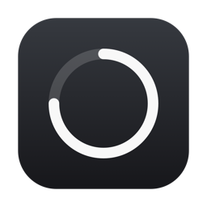
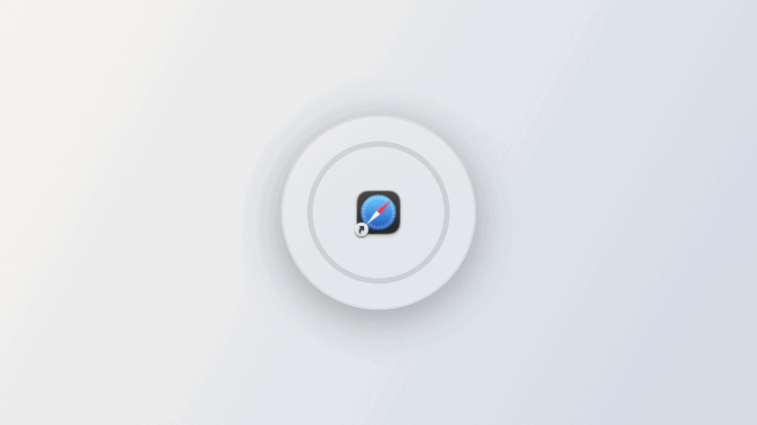
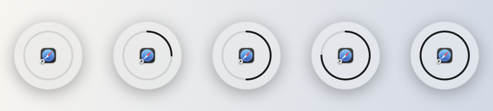

<div align="center">



# Delayed Cmd+Q

**别让误按的 ⌘Q 毁掉你的工作。**

不要轻点 ⌘Q，而是按住不放。按住时会有一个圆环顺时针填满，<br>
中途松手则什么都不会发生。

[](https://www.apple.com/macos/)
[](https://swift.org)
[](LICENSE)
[](https://github.com/mnjn00/DelayedCmdQ/releases/latest)
[](https://github.com/mnjn00/DelayedCmdQ/releases)

[English](README.md) · [한국어](README.ko.md) · [日本語](README.ja.md) · **简体中文**

<picture>
  <source media="(prefers-color-scheme: dark)" srcset="docs/images/demo-dark.gif">
  
</picture>

</div>

---

## 为什么需要它

⌘Q 就在 ⌘Tab 的正下方，与 ⌘W 仅隔一个键。一旦误按，应用立刻退出，没保存的内容也随之
消失。

Delayed Cmd+Q 会在任何应用收到这个快捷键之前将其拦截。现在退出需要有意识地按住不放，
圆环会准确显示还需坚持多久。中途松手，这次按键会被彻底丢弃，应用甚至不会知道它被按过。

## 特性

- **按住才退出** —— ⌘Q 需要按住你自己设定的时长
- **极简 HUD** —— 只有轮廓的圆环，从 12 点方向顺时针填满
- **液态玻璃** —— 在 macOS 26 Tahoe 及以上使用真正的 Liquid Glass，更早的系统则使用当时的原生材质
- **浅色/深色** —— 跟随系统，或固定为其中之一
- **四种语言** —— English、한국어、日本語、简体中文，可跟随系统或手动指定
- **可调延迟** —— 0.3 至 5.0 秒，可在设置中即时预览
- **可选连续退出** —— 继续按住以处理下一个应用，或在第一个之后停止
- **识别键盘布局** —— 在 AZERTY、QWERTZ 以及中文、日文、韩文输入状态下均正确
- **不打扰** —— 仅驻留菜单栏，无 Dock 图标，随时可暂停
- **不影响其他快捷键** —— ⌘⇧Q（注销）与 ⌘⌥Q 均原样放行

<div align="center">
<picture>
  <source media="(prefers-color-scheme: dark)" srcset="docs/images/ring-dark.png">
  
</picture>
</div>

## 安装

### 下载

1. 从[最新发布](https://github.com/mnjn00/DelayedCmdQ/releases/latest)获取 **`DelayedCmdQ.zip`**。
2. 解压后将 `DelayedCmdQ.app` 移动到 `/Applications`。
3. 移除下载隔离标记：

```bash
xattr -dr com.apple.quarantine /Applications/DelayedCmdQ.app
```

> [!NOTE]
> 需要第 3 步，是因为本应用采用 ad-hoc 签名而非公证（notarize）—— 背后并没有付费的
> Apple Developer 账号。若跳过该步骤，macOS 会提示应用已损坏。如果你不想执行这条命令，
> 也可以[从源码构建](#从源码构建)，结果完全相同。

### 从源码构建

需要 macOS 14 及以上和 Xcode 26（Swift 6）。

```bash
git clone https://github.com/mnjn00/DelayedCmdQ.git
cd DelayedCmdQ
./Scripts/build-app.sh
cp -R build/DelayedCmdQ.app /Applications/
```

加上 `UNIVERSAL=1` 可构建 Intel + Apple Silicon 通用二进制。

## 首次运行

拦截 ⌘Q 需要**辅助功能**权限。

1. 启动应用，它会请求权限并打开设置窗口。
2. 前往**系统设置 → 隐私与安全性 → 辅助功能**。
3. 启用 **Delayed Cmd+Q**。

授权后立即开始生效，无需重新启动。应用只驻留在菜单栏，没有 Dock 图标。

> [!IMPORTANT]
> 从源码重新构建后，ad-hoc 签名会改变，macOS 会重置该权限。请在辅助功能列表中用 `−`
> 删除旧条目，再添加新构建的版本。

## 设置

从菜单栏图标打开，或按 <kbd>⌘</kbd><kbd>,</kbd>。

| 选项 | 说明 | 默认值 |
| --- | --- | --- |
| **延迟时间** | 需要按住 ⌘Q 的时长 | `1.0 秒` |
| **主题** | 跟随系统 / 浅色 / 深色 | 跟随系统 |
| **语言** | 跟随系统 / English / 한국어 / 日本語 / 简体中文 | 跟随系统 |
| **允许连续退出** | 持续按住时继续退出下一个应用 | 关闭 |
| **暂停** | 恢复 ⌘Q 的原有行为 | 关闭 |
| **登录时启动** | 注册为登录项 | 关闭 |
| **显示应用图标** | 在圆环中央显示将被退出的应用图标 | 开启 |

点击设置窗口顶部的圆环，即可按当前延迟时间预览。

### 连续退出

**关闭**（默认）时，第一个应用退出后，无论你按住多久都不会再发生任何事情。

**开启**时，应用会等待焦点真正落到另一个应用上，再为它从头开始填充圆环。每一次退出仍
需要完整按住，因此一次按键绝不会一口气清掉一堆应用。如果三秒内焦点没有转移 —— 例如弹出
了保存确认对话框 —— 连锁就此停止。

## 实现原理

```
Sources/DelayedCmdQKit/
  App/         应用代理、菜单栏项、主菜单、设置窗口
  Core/        事件拦截、按住状态机、倒计时、权限、键盘布局
  Overlay/     覆盖层面板与进度圆环视图
  Settings/    偏好设置模型与设置界面
```

行为由三个部分支撑：

- **`QuitKeyMonitor`** 以 `.defaultTap` 模式接入会话事件拦截，直接丢弃 ⌘Q 的按下事件。
  前台应用完全不知道该快捷键被按过；只有按住完成时，`QuitCoordinator` 才会显式请求它
  退出。
- **`QuitHoldMachine`** 是一个纯值类型，承载按住过程的全部状态转移。它接收的是语义化输入
  而非事件，因此无需辅助功能权限或伪造 `CGEvent` 就能测试整个生命周期。
- **`KeyboardLayout`** 通过 `UCKeyTranslate` 在当前支持 ASCII 的布局中解析 Q 的键码 ——
  这正是 macOS 自身处理命令快捷键所依据的布局，因此在 Q 的物理位置与 QWERTY 不同的环境
  下依然准确。

### 开发

```bash
swift build     # 编译
swift test      # 运行测试
```

事件拦截与覆盖层需要系统权限和屏幕，因此不做单元测试。按住状态机、快捷键匹配、延迟时间
策略与设置持久化均已被测试覆盖。

## 致谢

灵感来自 [qblocker](https://github.com/steve228uk/qblocker)，它在 macOS 上开创了这一思路。

## 许可证

[MIT](LICENSE) © mnjn00
